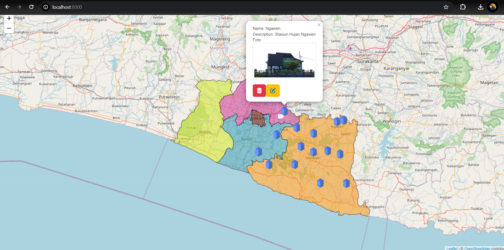

# Informasi Produk

**Nama:** Dhimar Fadhilansyah Darojat  
**NIM:** 22/493570/SV/20710  
**Kelas:** PGWL-A  

---

## DASOY-HIS (DAS Oyo-Hydrological Information System)

DASOY-HIS adalah sebuah aplikasi WEB GIS (Geographic Information System) berbasis website yang memfasilitasi visualisasi, analisis, dan berbagi data geografis terkait dengan hidrologi. Produk ini dikembangkan untuk fokus pada analisis stasiun hujan Daerah Aliran Sungai Oyo (DAS Oyo) dan nilai presipitasi di Provinsi Daerah Istimewa Yogyakarta (DIY).

---

## Komponen Pembangun Produk

- Leaflet.JS
- Bootstrap
- HTML
- CSS
- GeoServer
- PhpMyAdmin
- JavaScript
- PHP
- Laravel

---

## Sumber Data

- Data Pribadi
- Shapefile Administrasi Provinsi DIY (diperoleh dari Ina Geoportal)
- Data Sebaran Stasiun Hujan DAS Oyo
- Citra CHIRPS (Climate Hazards Group InfraRed Precipitation with Station data) Tahun 2024

---

## Tangkapan Layar Komponen Penting Produk

---
